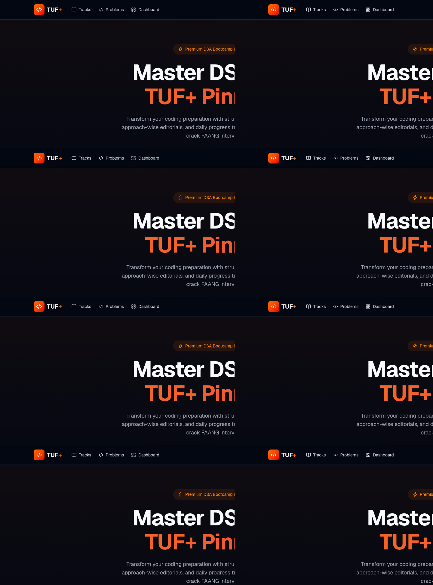
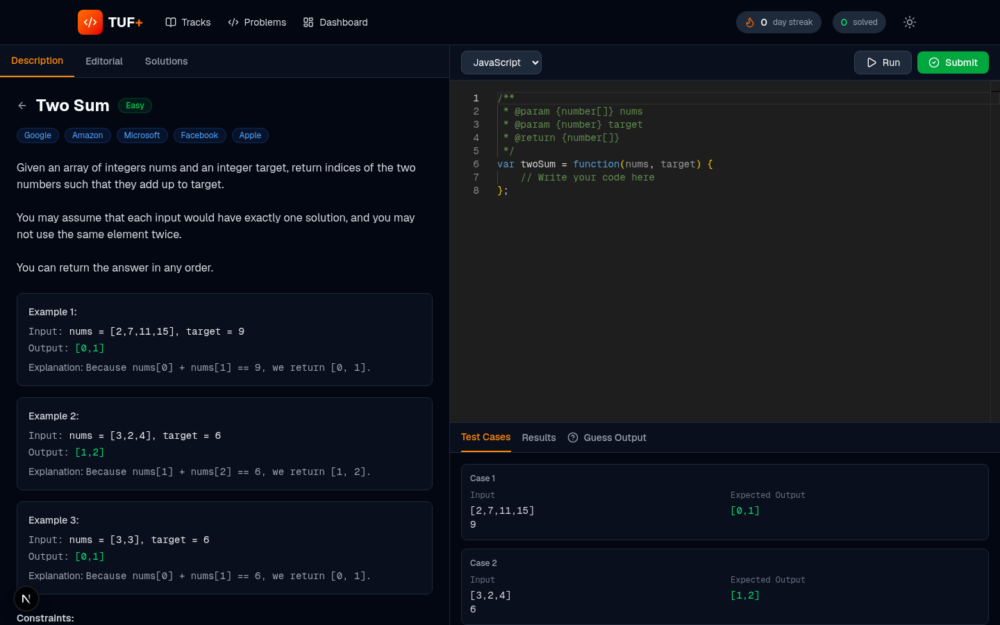
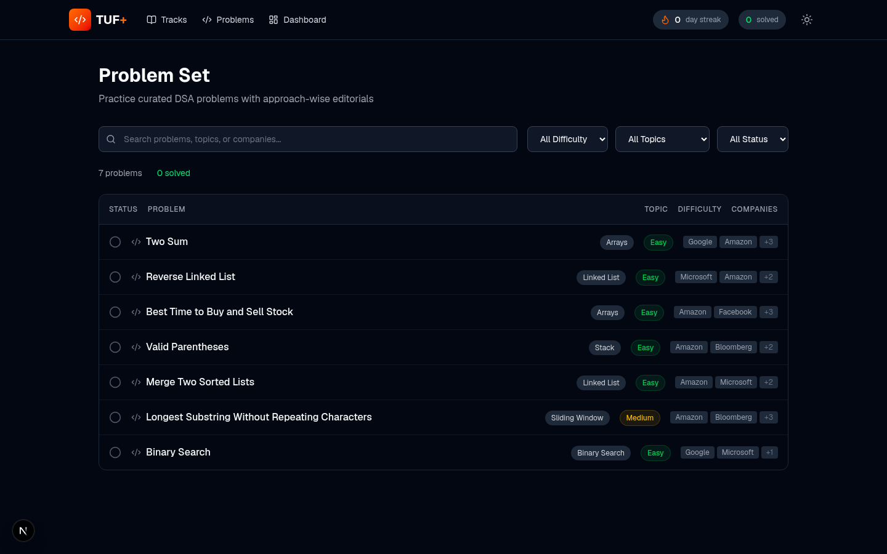
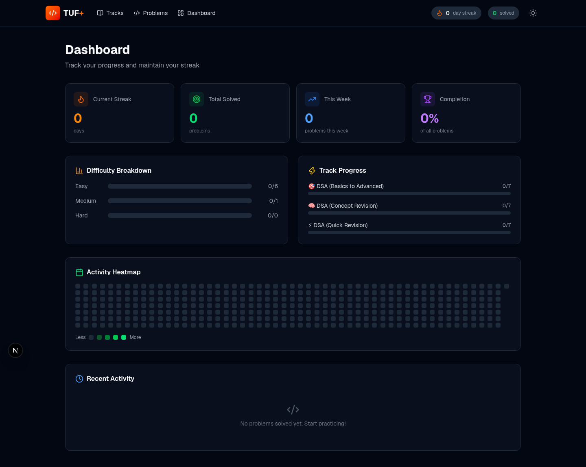

# AlgoTrack Premium - DSA Bootcamp Platform

A full-featured, interactive DSA (Data Structures & Algorithms) learning platform. Built with Next.js 16, TypeScript, Tailwind CSS, and Monaco Editor.


---

## Features

### Structured Track Variations

Three highly targeted learning tracks depending on your preparation timeline:

| Track | Problems | Duration | Focus |
|-------|----------|----------|-------|
| **DSA (Basics to Advanced)** | 1,000+ | 180 days | Deep-dive with logic-building modules for beginners |
| **DSA (Concept Revision)** | ~200 | 45 days | Pattern recognition and conceptual depth |
| **DSA (Quick Revision)** | ~80 | 10 days | Last-minute interview recall |

### Advanced Code Editor (IDE)

- **Monaco Editor** (same engine as VS Code) with full syntax highlighting
- **Multi-language support**: C++, Java, Python, JavaScript
- **Run & Submit** against all test cases with instant feedback
- **Execution metrics**: time and memory usage per test case

### Approach-Wise Split Editorials

Every problem includes up to three distinct solution approaches:

- **Brute Force** - naive/straightforward solution
- **Better** - improved approach with trade-offs
- **Optimal** - best possible time/space complexity

Each approach includes:
- Detailed intuition and algorithm steps
- Full solution code in all 4 languages
- One-click "Copy to Editor" functionality

### Guess Output Prompts

Active-learning checkpoints that test your dry-running skills:
- Read a code snippet and predict the output
- Multiple choice with instant feedback
- Detailed explanations for each answer

### Granular Complexity Analysis

- Visual comparison tables across all approaches
- Time & Space complexity with detailed explanations of **why** the solution fits those bounds
- Per-test-case execution time and memory indicators

### Daily Tracking & Progress Dashboard

- **Streak tracking** - maintain daily solving consistency
- **GitHub-style activity heatmap** - 365-day visualization
- **Difficulty breakdown** - Easy/Medium/Hard progress bars
- **Track progress** - completion percentage per track
- **Recent activity feed** - chronological solve history

### Problem Set

- Searchable and filterable problem list
- Filter by: difficulty, topic, status (solved/unsolved), company
- **Company tags** - problems tagged with FAANG and other companies that frequently ask them

---

## Tech Stack

| Technology | Purpose |
|-----------|---------|
| [Next.js 16](https://nextjs.org/) | React framework with App Router |
| [TypeScript](https://www.typescriptlang.org/) | Type safety |
| [Tailwind CSS 4](https://tailwindcss.com/) | Utility-first styling |
| [Monaco Editor](https://microsoft.github.io/monaco-editor/) | Code editor (VS Code engine) |
| [Zustand](https://github.com/pmndrs/zustand) | State management with localStorage persistence |
| [Lucide React](https://lucide.dev/) | Icon library |
| [Framer Motion](https://www.framer.com/motion/) | Animations |

---

## Getting Started

### Prerequisites

- Node.js 18+ 
- npm or yarn

### Installation

```bash
# Clone the repository
git clone https://github.com/yourusername/tuf-premium.git
cd tuf-premium

# Install dependencies
npm install

# Start the development server
npm run dev
```

Open [http://localhost:3000](http://localhost:3000) in your browser.

### Build for Production

```bash
npm run build
npm start
```

---

## Project Structure

```
src/
├── app/
│   ├── page.tsx              # Landing page
│   ├── tracks/
│   │   ├── page.tsx          # All tracks overview
│   │   └── [trackId]/
│   │       └── page.tsx      # Individual track with topics & problems
│   ├── problems/
│   │   └── page.tsx          # Filterable problem set
│   ├── ide/
│   │   ├── page.tsx          # Redirects to first problem
│   │   └── [slug]/
│   │       └── page.tsx      # Full IDE with editor, tests, editorial
│   ├── dashboard/
│   │   └── page.tsx          # Progress tracking & analytics
│   └── api/
│       └── run-code/
│           └── route.ts      # Code execution API endpoint
├── components/
│   └── layout/
│       └── Navbar.tsx        # Global navigation with streak display
├── data/
│   ├── problems.ts           # Problem definitions with all approaches
│   └── tracks.ts             # Track/topic structure
├── store/
│   └── useStore.ts           # Zustand store with persistence
├── lib/
│   └── utils.ts              # Helper functions
└── types/
    └── index.ts              # TypeScript type definitions
```

---

## Screenshots

### Landing Page


### IDE / Code Editor


### Problems List


### Dashboard


---

## Adding New Problems

Add problems to `src/data/problems.ts` following the `Problem` interface:

```typescript
{
  id: 'problem-slug',
  title: 'Problem Title',
  slug: 'problem-slug',
  difficulty: 'Easy' | 'Medium' | 'Hard',
  topic: 'Arrays',
  companies: ['Google', 'Amazon'],
  description: '...',
  constraints: ['...'],
  examples: [...],
  testCases: [...],
  approaches: [...],       // Brute, Better, Optimal
  starterCode: {...},      // All 4 languages
  solutions: {...},        // All approaches x all languages
  guessOutputPrompts: [...],
}
```

---

## Roadmap

- [ ] Backend code execution engine (Docker/Judge0 integration)
- [ ] User authentication and cloud sync
- [ ] Video editorial embeds
- [ ] Discussion/comments per problem
- [ ] Contest mode with timer
- [ ] Mobile responsive improvements
- [ ] Spaced repetition reminders
- [ ] More problems (targeting 400+ curated)

---

## Contributing

Contributions are welcome! Please feel free to submit a Pull Request.

1. Fork the repository
2. Create your feature branch (`git checkout -b feature/amazing-feature`)
3. Commit your changes (`git commit -m 'Add some amazing feature'`)
4. Push to the branch (`git push origin feature/amazing-feature`)
5. Open a Pull Request

---

## License

This project is licensed under the MIT License - see the [LICENSE](LICENSE) file for details.

---

## Acknowledgments

- Problem content inspired by popular DSA preparation resources
- Built for educational purposes

---

**Star this repo if you find it useful!**
